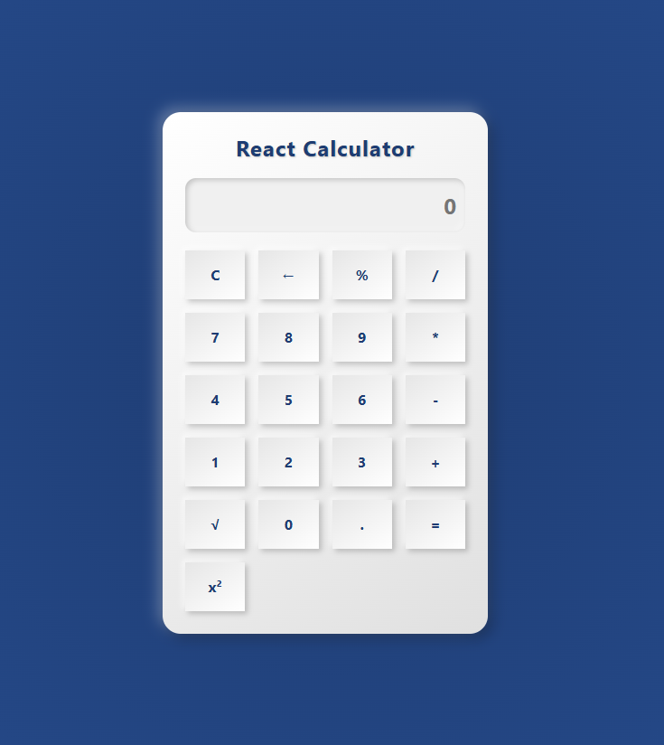

# Responsive React Calculator



A sleek and responsive calculator app built using React. Perfect for performing basic arithmetic operations on any device, from desktops to mobile phones.

## Features

- **Responsive Design**: Adapts seamlessly to different screen sizes.
- **Basic Arithmetic**: Perform addition, subtraction, multiplication, and division.
- **Clean UI**: Simple and intuitive user interface for ease of use.
- **Keyboard Support**: Operate using either the keyboard or on-screen buttons.

## Installation

Clone the repository and install the dependencies:

```bash
git clone https://github.com/your-username/responsive-react-calculator.git
cd responsive-react-calculator
npm install
